# Homework AWS Cloud Basic

####  7. Review Getting Started with Amazon EC2. Log Into Your AWS Account, Launch, Configure, Connectand Terminate Your Instance. Do not use Amazon Lightsail. It is recommended to use the t2 or t3.micro instance and the CentOS operating system.

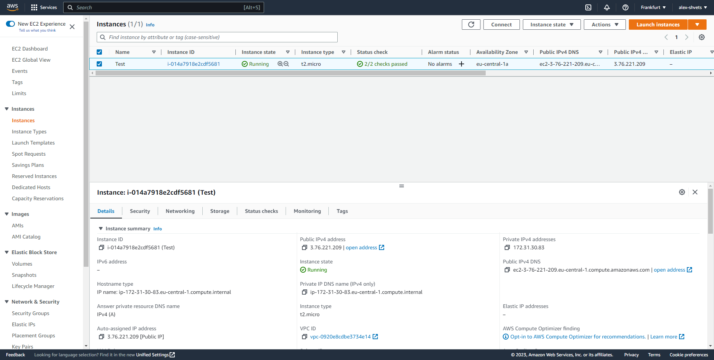
---
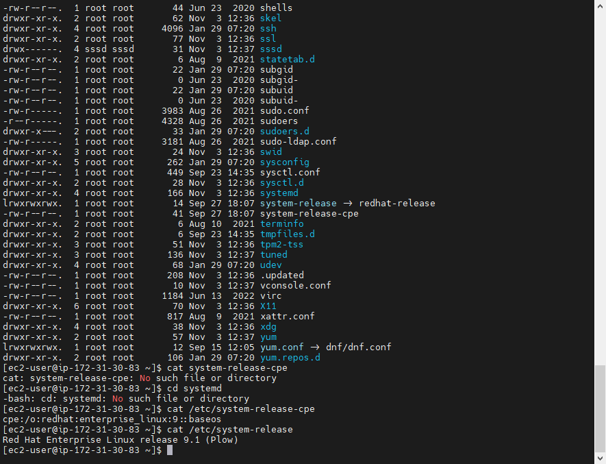
---

####  8. Create a snapshot of your instance to keep as a backup.
---
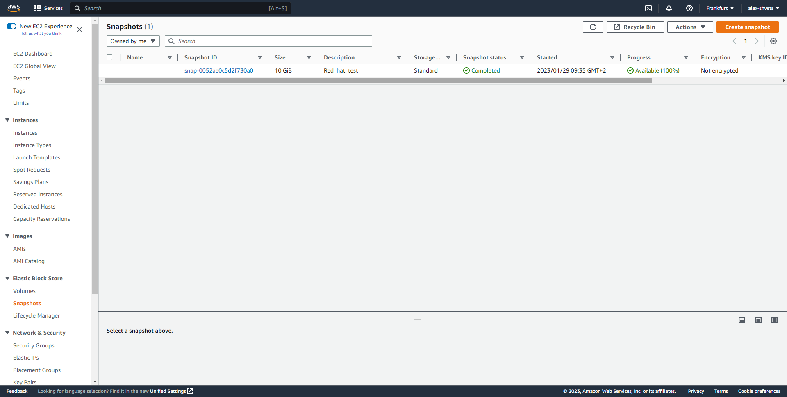
---

####  9. Create and attach a Disk_D (EBS) to your instance to add more storage space. Create and save some file on Disk_D.
---
Create Disk_d
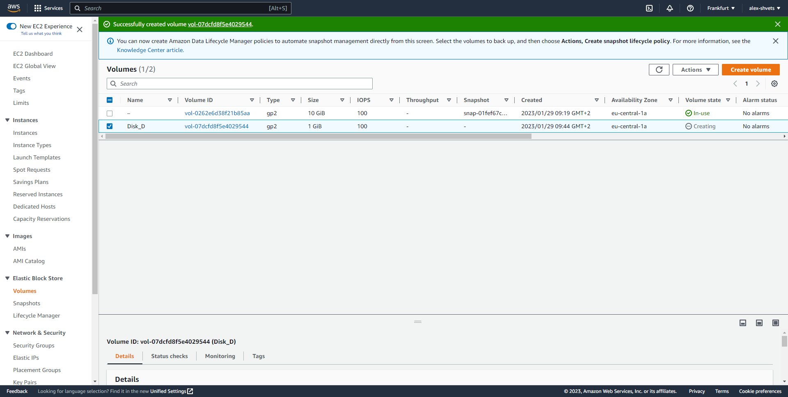
---

Attach Disk_D to my instance
````
lsblk
````
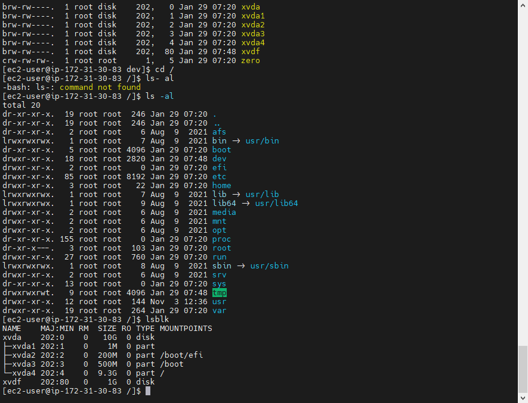
---
````
sudo fdisk /dev/xvdf
n
p
1
2048
2097151
w
sudo mkfs -t ext4 /dev/xvdf
mkdir /home/ec2-user/disk_d
sudo mount /dev/xvdf /home/ec2-user/disk_d/
````
CreateCreate and save some file on Disk_D
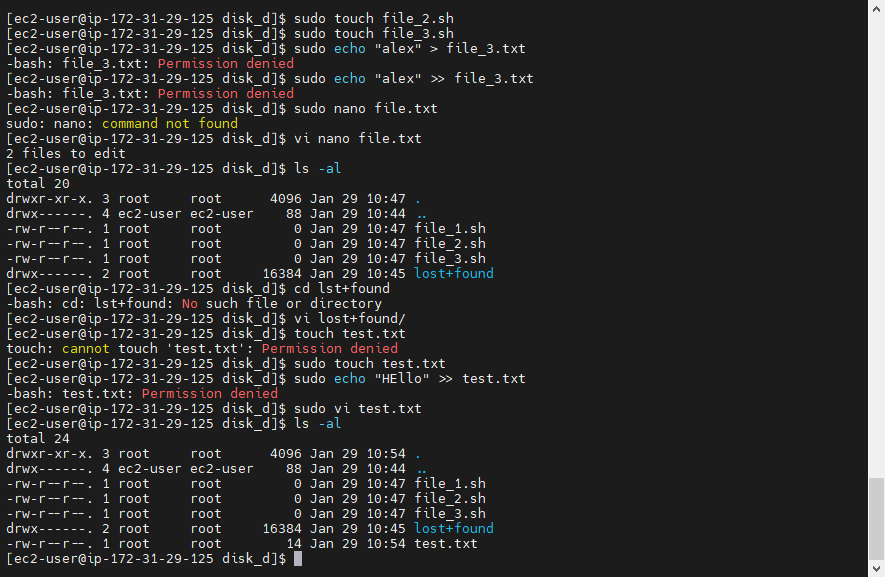
---
####  10. Launch the second instance from backup.
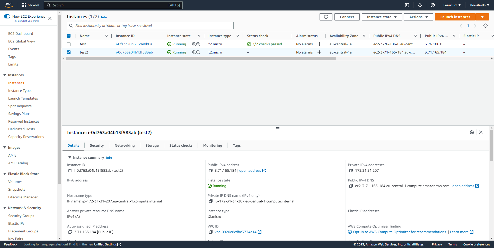
---
####  11. Detach Disk_D from the 1st instance and attach disk_D to the new instance.
Unmount Disk_D
````
sudo /home/ec2-user/disk_d
````
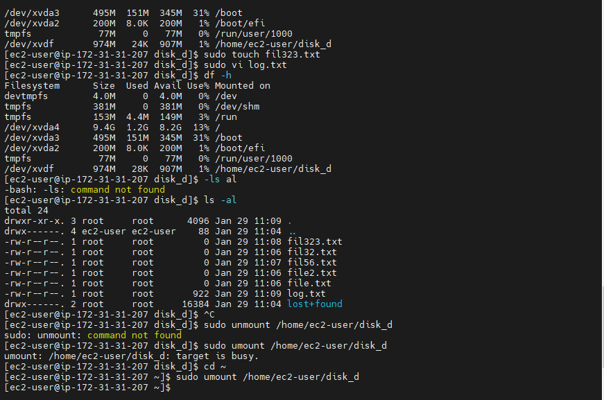

Attach Disk_D to new instance
````
mkdir /home/ec2-user/disk_d
sudo mount /dev/xvdf /home/ec2-user/disk_d/
ls -al /disk_d
````
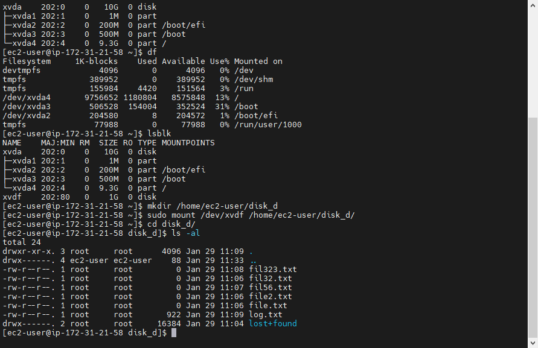
---

####  12. Register the domain name *.PP.UA and use it.

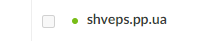
---

####  13. Launch and configure a WordPress instance with Amazon Lightsail.

Connect to instance and check password:
````
cat $HOME/bitnami_application_password
````

Enter a WordPress.

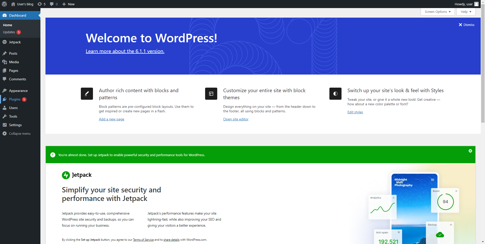

Delete a WordPress instance.
---

####  14. Review the 10-minute Store and Retrieve a File. Repeat, creating your own repository.

Create S3 buckets.

Upload some file to buckets:

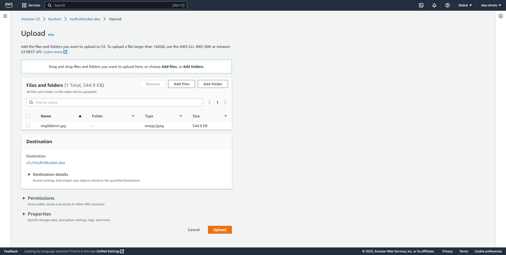
---

Create Dir "log" in s3 bucket:
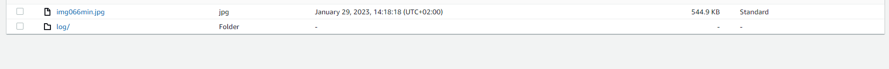
---

####  15. Batch upload files to the cloud to Amazon S3 using the AWS CLI.Create a user AWS IAM, configure CLI AWS and upload any files to S3.

Create a user AWS IAM:

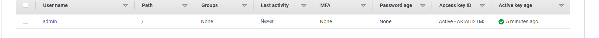
---

Install  AWS CLI.
Start PowerShell and write credentials.

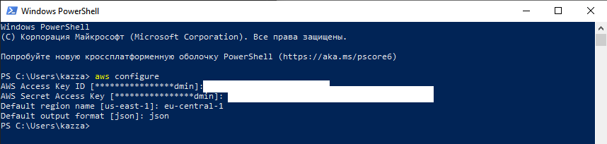
---

Write some command to use S3:
````
aws s3 mb s3://my-first-backup-bucket-alex-shvets-lol
````
---
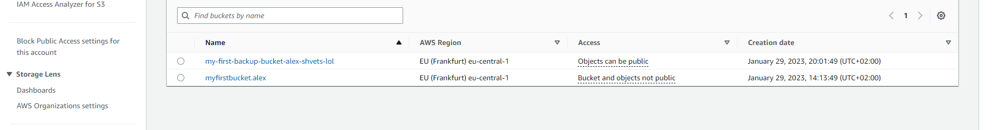
---
Delete s3 bucket:
````
aws s3api delete-bucket --bucket my-first-backup-bucket-alex-shvets-lol --region eu-central-1![]
````
(delete_s3.png)
---
Copy some file in another s3:
````
aws s3 cp "C:\Users\kazza\Downloads\squad.png"  s3://myfirstbucket.alex/
````
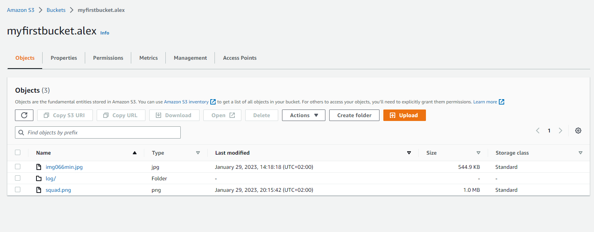
---
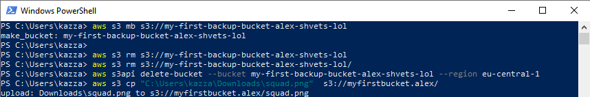
---

####  16. Deploy Docker Containers on Amazon Elastic Container Service.

Launch an instance with the Amazon Linux 2.
Connect to your instance using SSH.
Update the installed packages and package cache on your instance.
````
sudo yum update -y
````
Install the most recent Docker Engine package.
````
sudo amazon-linux-extras install docker
````
Start the Docker service.
````
sudo service docker start
````
Check docker status.
````
sudo systemctl status docker
````
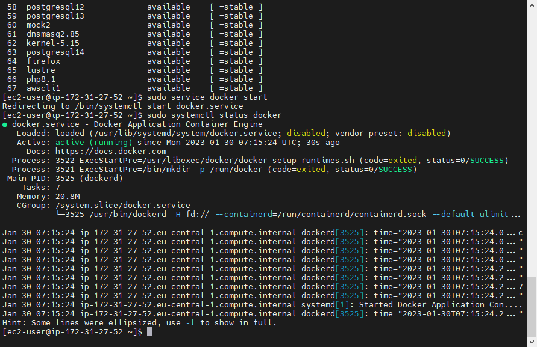
---
Create a Docker image
````
touch Dockerfile
````
Edit the Dockerfile you just created and add the following content.
````
FROM ubuntu:18.04

# Install dependencies
RUN apt-get update && \
 apt-get -y install apache2

# Install apache and write hello world message
RUN echo 'Hello World!' > /var/www/html/index.html

# Configure apache
RUN echo '. /etc/apache2/envvars' > /root/run_apache.sh && \
 echo 'mkdir -p /var/run/apache2' >> /root/run_apache.sh && \
 echo 'mkdir -p /var/lock/apache2' >> /root/run_apache.sh && \ 
 echo '/usr/sbin/apache2 -D FOREGROUND' >> /root/run_apache.sh && \ 
 chmod 755 /root/run_apache.sh

EXPOSE 80

CMD /root/run_apache.sh
````

Build the Docker image from your Dockerfile.
````
sudo docker build -t hello-world .
````
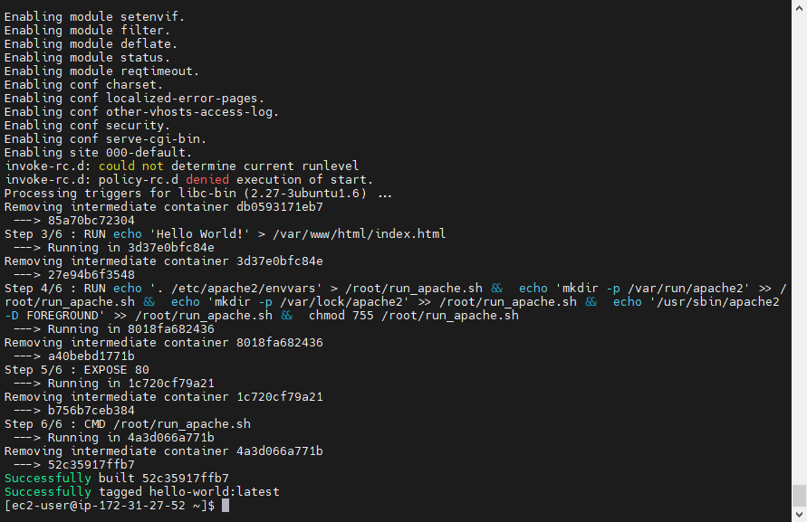
---
Run docker images.
````
docker run -t -i -p 80:80 hello-world
````
Create an Amazon ECR repository to store your hello-world image.
````
aws ecr create-repository --repository-name hello-world --region eu-central-1
````
---
Selete the repository
````
aws ecr delete-repository --repository-name hello-world --region eu-central-1 --force
````

####  17. Run a Serverless "Hello, World!" with AWS Lambda.
Use AWS Lambda.
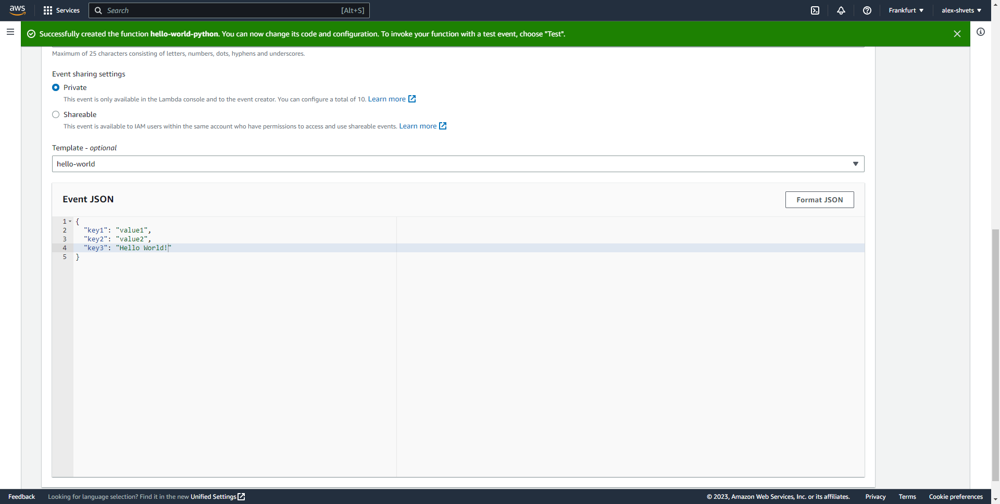
---
Show results.
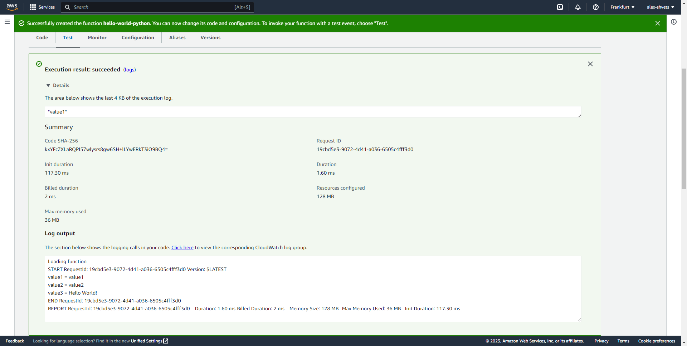
---

####  18. Create a static website on Amazon S3, publicly available (link1 or link2 - using a custom domain registered with Route 53). Post on the page your own photo, the name of the educational program (EPAM Cloud&DevOps Fundamentals Autumn 2022), the list of AWS services with which the student worked within the educational program or earlier and the full list with links of completed labs (based on tutorials or qwiklabs). Provide the link to the website in your report and СV.

[My S3 web site](http://shveps.pp.ua.s3-website.eu-central-1.amazonaws.com/)


