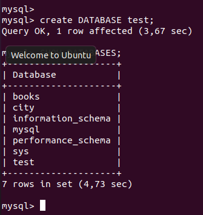

# Database Administration Homework

## TASK DB1

### PART 1

#### 1-2. Download MySQL server for your OS on VM and install MySQL server on VM.
Use Ubuntu 20.04 
```` 
sudo apt-get update 
sudo apt-get install mysql-server
sudo systemctl start mysql.service
````
---
#### 3-4. Select a subject area and describe the database schema and Create a database on the server through the console.
Start work in MySQL  
````
sudo mysql
````
Create DATABASE "city";
````MySQL
CREATE DATABASE city;
USE city;
````
Create tables
````MySQL
CREATE TABLE areas (
    name VARCHAR(50) NOT NULL,
    population INT NOT NULL,
    PRIMARY KEY (name)
);

CREATE TABLE hospitals (
    id INT NOT NULL AUTO_INCREMENT,
    name VARCHAR(50) NOT NULL,
    phone_number VARCHAR(10) NOT NULL,
    e_mail  VARCHAR(50) NOT NULL,
    areas VARCHAR(50) NOT NULL,
    PRIMARY KEY (id),
);

CREATE TABLE hotels (
    id INT NOT NULL AUTO_INCREMENT,
    name VARCHAR(50) NOT NULL,
    phone_number VARCHAR(10) NOT NULL,
    e_mail  VARCHAR(50) NOT NULL,
    areas VARCHAR(50) NOT NULL,
    PRIMARY KEY (id),
);

````
---
#### 5. Fill in tables.
````MySQL
INSER INTO areas (name, population)
    VALUES 
    ('Brooklyn', 2459000),
    ('Staten Island', 441000),
    ('Queens', 2233000),
    ('Manhattan', 1525000),
    ('Bronx', 1376000);

INSERT INTO hospitals (name, phone_number, e_mail, areas)
    VALUES
    ('BELLEVUE HOSPITAL CENTER', 56546546, 'bellevue@ny.com', 'Manhattan'),
    ('BETH ISRAEL MEDICAL', 34522200, 'beth_israel@gmail.com', 'Bronx'),
    ('COLUMBIA', 10031005, 'columbia@ny.org.com', 'Queens'),
    ('LENOX HILL', 44432232, 'lenox_hill@healthy.com', 'Brooklyn');

INSERT INTO hotels (name, phone_number, e_mail, areas)
    VALUES
    ('HILLTON', 33446677, 'hilton@gmail.com', 'Manhattan'),
    ('GRAND HOTEL', 77665544, 'grand_hotel@ny.com', 'Manhattan'),
    ('ISLAND', 00031003, 'island_staten@org.com', 'Staten Island');
````
---
#### 6-7. Construct and execute SELECT operator with WHERE, GROUP BY and ORDER BY and Execute other different SQL queries DDL, DML, DCL.
````MySQL
SELECT * FROM areas 
    WHERE population > 2000000;
````

---
````MySQL
SELECT name FROM hospitals
    ORDER BY areas;
````

---
````MySQL
SELECT SUBSTR(name,1,1) 
    FROM hotels
    GROUP BY SUBSTR(name,1,1);
````

--- 
````MySQL
ALETER TABLE areas 
    ADD square VARCHAR(20);
````

---
#### 8. Create a database of new users with different privileges. Connect to the database as a new user and verify that the privileges allow or deny certain actions.
Create first user "Sara" with all privileges:

````MySQL
sudo mysql
CREATE USER 'sara'@'localhost' IDENTIFIED BY '*****';
GRANT ALL PRIVILEGES ON *.* TO 'sara'@'localhost' WITH GRANT OPTION;
FLUSH PRIVILEGES;
````
Сheck some queries:
````MySQL
mysql -u sara -p
````


````MySQL
SHOW GRANTS FOR 'sara'@'localhost';
````


````MySQL
CREATE DATABASE test;
SHOW DATABASES;
````

---
Create second user "Siri" with privileges (INSERT, SELECT):
````MySQL
CREATE USER 'siri'@'localhost' IDENTIFIED BY '*****';
GRANT INSERT, SELECT on city.* TO 'siri'@'localhost' WITH GRANT OPTION;
FLUSH PRIVILEGES;
SHOW GRANTS FOR 'siri'@'localhost';
````
Сheck some queries:
````MySQL
mysql -u siri -p
````


````MySQL
SHOW GRANTS FOR 'siri'@'localhost';
````


````MySQL
CREATE DATABASE test1;
SELECT * FROM city.hospitals;
````

---
#### 9.
