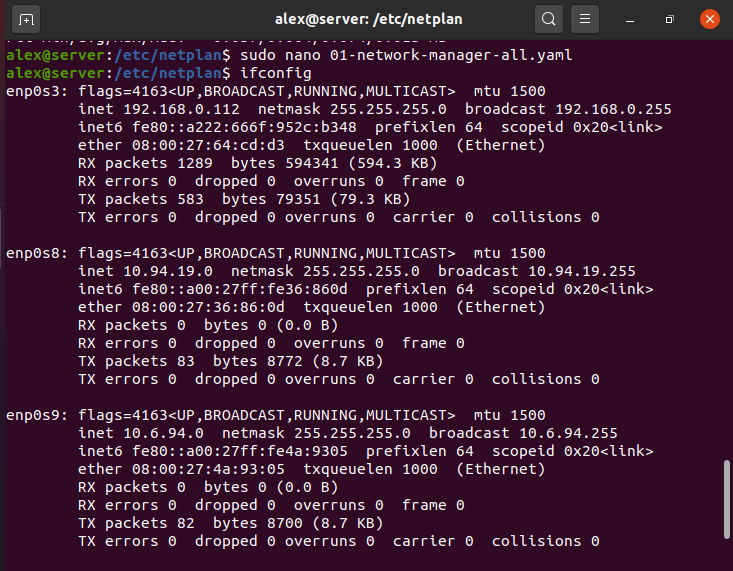
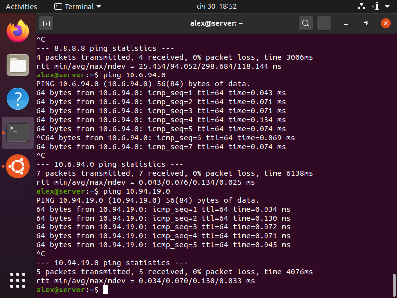

# Module – Linux Networking
#### 1. Configurate static IP on Server_1 all interface.

Use Ubuntu 20.04 on Server_1
Create Netplan:
````
cd /etc/netplan/
sudo nano 01-network-manager-all.yaml
````
---
Configurate Netplan file:
````yaml
# Let NetworkManager manage all devices on this system
network:
  version: 2
  render: NetworkManager
  ethernets:
    enp0s3:
      addresses: [192.168.0.172/24]
      gateway4: 192.168.0.255
      dhcp4: yes
    enp0s8:
     addresses: [10.94.19.0/24]
    enp0s9:
     addresses: [10.6.94.0/24]
````
````
netplan try
netplan apply
````

Check net interface:
````
ifconfig
````

---

#### 2. On Server_1 configurate DHCP service, that will be configurate addres Int1 Client_1 and Client_2.

````
sudo apt install isc-dhcp-server -y
sudo systemctl restart isc-dhcp-server.service
sudo nano /etc/dhcp/dhcpd.conf


subnet 192.168.0.0 netmask 255.255.255.0{
  range 192.168.0.200 192.168.0.220;
}

host Client1 {
hardware ethernet 08:00:27:78:3A:4C;
fixed-address 10.94.19.0/24;
}

host Client2 {
 hardware ethernet 08:00:27:FF:1B:E7;
 fixed-address 10.6.94.0/24; 
}
````


